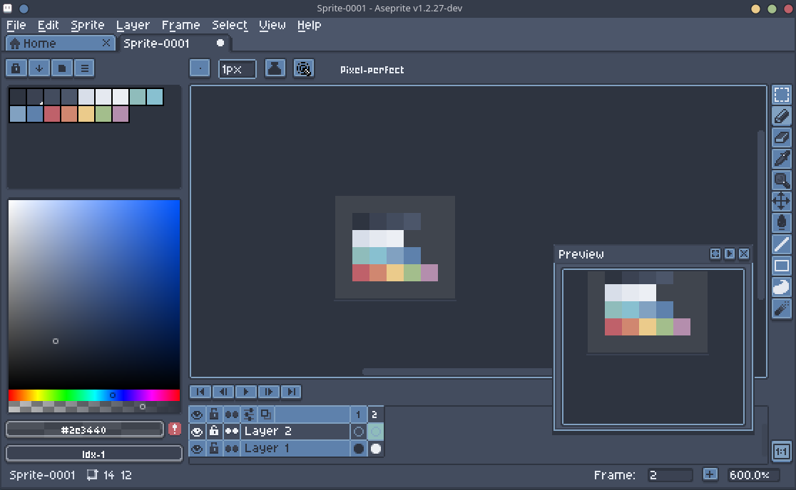
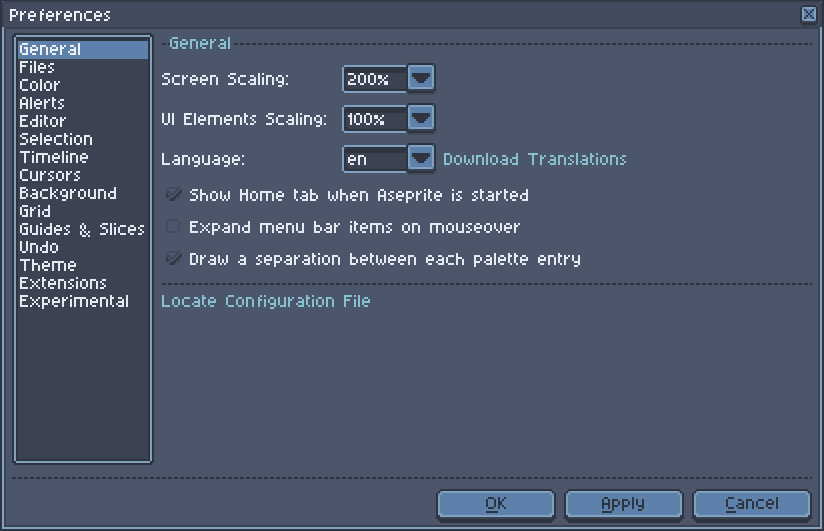
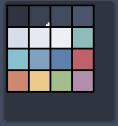

# Nord for [Aseprite](https://www.aseprite.org/)

> A dark theme for [Aseprite](https://www.aseprite.org/).

Also includes the Nord color palette:

## Install

All instructions can be found in [INSTALL.md](./INSTALL.md).

### Help

If you find anything which doesn't fit into the theme or have any suggestions, feel free to  open an [Issue on GitHub](https://github.com/marsn3/aseprite-nord/issues/new "New Issue &#183; marsn3/aseprite-nord").

#### License

This theme is based on [Aseprite Than](https://tungkradle.github.io/aseprite-than/) by [tungkradle](https://github.com/tungkradle/) and the default theme of [Aseprite](http://aseprite.org "Aseprite - Animated sprite editor & pixel art tool") by Ilija Melentijevic & David Capello.  
Therefore the [Aseprite Eula](https://github.com/aseprite/aseprite/blob/master/EULA.txt "aseprite/EULA.txt at master &#183; aseprite/aseprite") applies on this project, too.

The Nord theme is subject to the [MIT License](./LICENSE).
